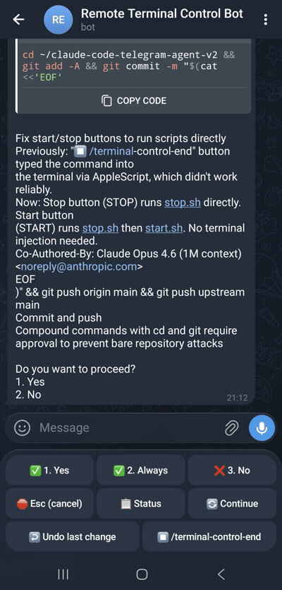

# Claude Code Telegram Agent

Control any Claude Code terminal session remotely via Telegram. Mirror terminal output, send commands, approve/reject actions, and use voice input — all from your phone.

<p align="center">
  
  <br/>
  <em>Approve code changes, view diffs, and control Claude Code — all from Telegram</em>
</p>

## ✨ Features

### Core
- **Two-way sync** — Terminal output → Telegram, Telegram input → Terminal
- **Smart formatting** — Code diffs with syntax highlighting, bash commands in code blocks, tables as mobile cards
- **Approval workflow** — Approve/reject Claude Code actions with one tap
- **Voice input** — Send voice messages, review transcription, then send to terminal
- **Persistent keyboard** — Quick-access buttons: Yes / No / Escape / Status / Continue
- **Cross-platform** — macOS (Terminal.app), Linux (tmux), Windows (PowerShell + Git Bash)

### Live Status Indicators
- ⏳ / ⌛ **Working** — Alternating hourglass with elapsed time
- ⚡ **Running tool** — Shows which tool is active
- 🟡 **Awaiting approval** — Waiting for your response
- ✅ **Done** — Task completed with duration
- ❌ **Error** — Error detected with auto-pinning
- 💤 **Idle** — No activity for 5+ minutes

### Reliability
- 🔁 **Auto-reconnect watchdog** — Restarts crashed daemons automatically (max 5 retries)
- 🔒 **Atomic locking** — No duplicate daemon instances
- ⏱️ **Session timer** — Tracks elapsed time, shown on disconnect
- 💓 **Connection heartbeat** — Detects connection loss
- 📎 **Long output as file** — Outputs > 4096 chars sent as .txt attachment

### Security
- 🔐 **Secret redaction** — API keys, tokens, JWTs auto-masked before sending
- 🔑 **macOS Keychain support** — Store credentials securely (optional)
- 👤 **Sender authentication** — Only your Telegram ID can control the bot
- 🛡️ **Command blocklist** — Dangerous commands (rm -rf, etc.) are blocked

### Smart Formatting
- 🔤 **Unicode support** — Cyrillic, CJK, emoji — uses clipboard paste for non-ASCII
- 📝 **Diff highlighting** — Green/red syntax with line numbers
- 🧹 **Clean status lines** — Terminal UI hints stripped (no "shift+tab to cycle" noise)
- 📌 **Error pinning** — Errors auto-pinned in chat, auto-unpinned after 5 min

## 🚀 Quick Start

```bash
# 1. Clone the repo
git clone https://github.com/boot2load/claude-code-telegram-agent.git
cd claude-code-telegram-agent

# 2. Create a Telegram bot via @BotFather and get your bot token

# 3. Run the setup wizard
./setup.sh

# 4. In your project's terminal, launch Claude Code and type:
/terminal-control-start

# Linux: run Claude Code inside tmux first:
# tmux new -s claude
# claude
# Then /terminal-control-start
```

## 📱 Button Reference

| Button | Action | When to use |
|--------|--------|-------------|
| **✅ 1. Yes** | Approve | Approve a tool/edit/command |
| **✅ 2. Always** | Always approve | Don't ask again for this tool type |
| **❌ 3. No** | Reject | Reject a tool/edit/command |
| **🛑 Esc (cancel)** | Escape key | Interrupt Claude mid-action |
| **📋 Status** | Status request | Get a progress update |
| **🔄 Continue** | Continue | Tell Claude to keep going |
| **↩️ Undo last change** | Undo | Revert last edit |
| **⏹ /terminal-control-end** | Stop session | Disconnect bot (runs stop.sh directly) |

## 🎙️ Voice Input

Send a voice message in Telegram:

1. **🎙 Transcribing...** — processing notification
2. Bot shows the transcribed text
3. Press **✅ Yes** to send to terminal, or **❌ No** to cancel

| Backend | Speed | Cost | Setup |
|---------|-------|------|-------|
| **mlx-whisper** | ~2-3s | Free | Automatic (setup.sh installs it) |
| **OpenAI Whisper API** | ~1s | $0.006/min | Requires API key |

## ⚙️ Configuration

All settings in `config.json` (created by `setup.sh`):

```json
{
  "telegram": {
    "bot_token": "your-bot-token",
    "chat_id": "your-chat-id",
    "allowed_user_id": "your-telegram-user-id"
  },
  "project": {
    "name": "Terminal",
    "working_directory": "",
    "window_match_string": "",
    "tmux_session": ""
  },
  "voice": {
    "backend": "mlx-whisper",
    "mlx_model": "mlx-community/whisper-tiny.en-mlx",
    "openai_api_key": ""
  },
  "idle_timeout_seconds": 300
}
```

### Multi-Project Support

No reconfiguration needed — if `window_match_string` is empty, the bot automatically follows whichever Claude Code terminal is active.

To target a specific project, set `window_match_string` to a unique string in the terminal window title (e.g., "myproject").

## 🏗️ Architecture

```
                    Claude Code Telegram Agent

  YOUR TERMINAL                              YOUR PHONE
  ============                               ==========

  Terminal.app ◄──── AppleScript ────► terminal-watcher.py
  (Claude Code)      reads screen          │
       ▲             injects keys          │ sends formatted
       │                                   │ output via API
       │                                   ▼
  type-to-terminal.sh              Telegram Bot API
       ▲                                   │
       │                                   │ delivers to
       │                                   ▼
  poll.sh ◄──── HTTP polling ────► Telegram Chat 📱
       │         every 1-3s          (buttons, voice,
       │                              text input)
       │
  watchdog.sh
  (monitors poll.sh + watcher,
   auto-restarts on crash)
```

**Data Flow:**
- **Terminal → Phone:** `terminal-watcher.py` reads screen via AppleScript/tmux → formats output → sends to Telegram
- **Phone → Terminal:** `poll.sh` checks Telegram for messages → `type-to-terminal.sh` injects keystrokes
- **Reliability:** `watchdog.sh` monitors both daemons, auto-restarts if either crashes

## 📁 Files

| File | Purpose |
|------|---------|
| `setup.sh` | Interactive setup wizard |
| `config.json` | All settings (gitignored) |
| `scripts/start.sh` | Activate session + launch watchdog |
| `scripts/stop.sh` | Deactivate session + cleanup |
| `scripts/poll.sh` | Telegram → Terminal daemon |
| `scripts/terminal-watcher.py` | Terminal → Telegram daemon |
| `scripts/watchdog.sh` | Auto-restart crashed daemons |
| `scripts/type-to-terminal.sh` | Keystroke injection (AppleScript/tmux/PowerShell) |
| `scripts/transcribe-voice.sh` | Voice transcription |
| `scripts/send.sh` | Send a Telegram message |
| `scripts/check-inbox.sh` | Check for incoming messages |
| `commands/` | Claude Code slash command templates |

## 🔒 Security: Credential Storage

**macOS:** Store credentials in macOS Keychain (optional):
```bash
security add-generic-password -U -s "remote-terminal-telegram" -a "bot_token" -w "YOUR_TOKEN"
```

**Linux:** Credentials stored in `config.json` with `chmod 600` (owner-only).

## 📄 License

MIT
